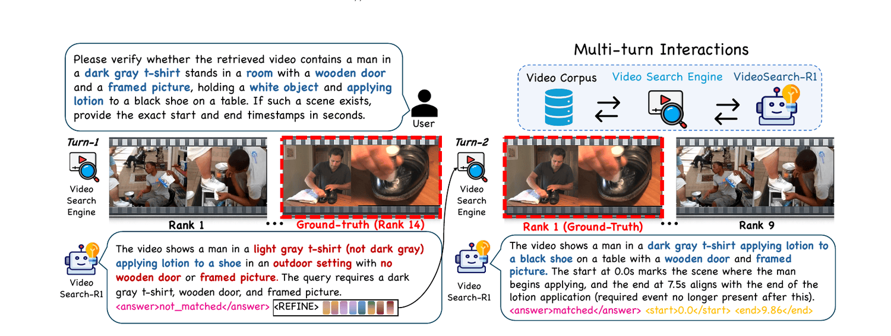
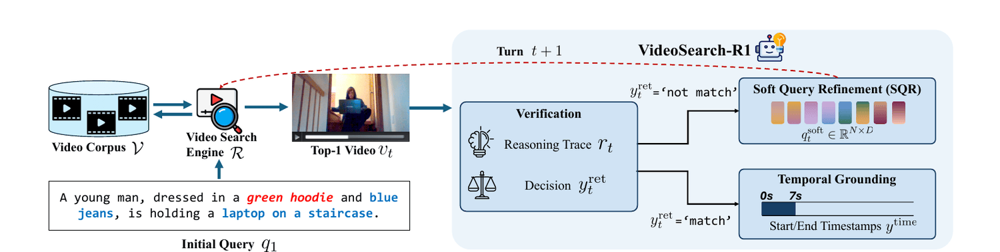
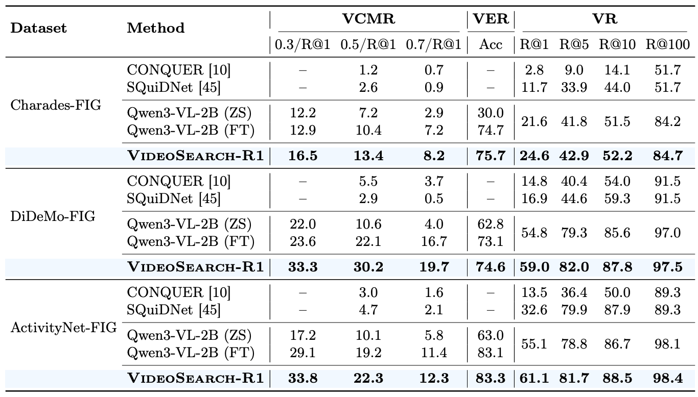

<div align="center">

# VideoSearch-R1: Iterative Video Retrieval and Reasoning via Soft Query Refinement

<p>
  <a href="https://img.shields.io/badge/ECCV-2026-1a73e8"></a>
  <a href="#"></a>
  <a href="https://mlvlab.github.io/VideoSearch-R1/"></a>
  <a href="https://huggingface.co/VideoSearchR1"></a>
  <a href="LICENSE.txt"></a>
</p>

**[Seohyun Lee](https://www.seohyunleee.com/)<sup>1,\*</sup> &nbsp;
[Seoung Choi](https://choisw0823.github.io)<sup>1,\*</sup> &nbsp;
[Dohwan Ko](https://ikodoh.github.io/)<sup>2,\*</sup> &nbsp;
[Jongha Kim](https://jonghakim35.github.io/)<sup>2</sup> &nbsp;
[Hyunwoo J. Kim](https://www.hyunwoojkim.com/home)<sup>1,&dagger;</sup>**

<sup>1</sup> KAIST &nbsp;&nbsp; <sup>2</sup> Korea University &nbsp;&nbsp;
<sub>(\* equal contribution &nbsp; &dagger; corresponding author)</sub>

<br>



</div>

> **TL;DR** — **VideoSearch-R1** is an agentic framework that unifies **inter-video retrieval** and **intra-video reasoning** through multi-turn interaction with a video search engine. We introduce **Soft Query Refinement (SQR)**, which refines query tokens in a *continuous latent space* instead of rewriting text, and train it with **GRPO**. VideoSearch-R1 reaches state-of-the-art Video Corpus Moment Retrieval (VCMR) on three benchmarks while using far fewer generated tokens than text-level refinement.

---

## 📰 News

-  🎉 VideoSearch-R1 is accepted to **ECCV 2026**.
-  Code released.
-  Trained model checkpoints released.
-  Dataset released.
-  Paper preprint coming soon.

## 🤖 For AI-Assisted Reproduction

If you use Codex, Claude Code, or another coding assistant to reproduce the project, give it a concrete workspace with enough free storage. The scripts write data, checkpoints, logs, and caches under `VIDEOSEARCH_WORKSPACE`; set it to a large local disk path such as `/path/to/large/workspace/videosearchr1`.

Charades-STA is the lightest prepared dataset. If you only want to verify inference with a released checkpoint, start with **Quick Start: Inference with Released Checkpoints** on `charades`.

<details>
<summary><b>Suggested resources</b></summary>

<br>

| Goal | Recommended free workspace | GPU |
| --- | ---: | --- |
| Quick inference on `charades` | 130 GB | 1 GPU; a single RTX 3090 is enough with conservative eval settings |
| Quick inference on `didemo` | 240 GB | 1 GPU; a single RTX 3090 is enough with conservative eval settings |
| Quick inference on `activitynet` | 470 GB | 1 GPU; a single RTX 3090 is enough with conservative eval settings |
| Toy end-to-end process | 80 GB | 1-4 GPUs depending on how much smoke training you enable |
| Stage 1 or Stage 2 training from prepared `charades` data | 150 GB | 4x A6000-class GPUs recommended |
| Stage 1 or Stage 2 training from prepared `didemo` data | 280 GB | 4x A6000-class GPUs recommended |
| Stage 1 or Stage 2 training from prepared `activitynet` data | 520 GB | 4x A6000-class GPUs recommended |
| Start from scratch with raw videos and feature extraction | 1 TB preferred | 4x A6000-class GPUs recommended |

Prepared-data bucket manifests are approximately 107 GiB for `charades`, 215 GiB for `didemo`, and 436 GiB for `activitynet`. Released checkpoints add about 5 GiB per model, and training creates additional checkpoints, logs, and caches.

If the available workspace is below the requested target, the assistant should stop before downloading data and report that the data storage is insufficient.

</details>

<details>
<summary><b>Prompt: Quick Charades Inference</b></summary>

```text
I want to run VideoSearch-R1 inference only. I have <FREE_GB> GB free at <WORKSPACE_PATH>. Use the official repository https://github.com/mlvlab/VideoSearch-R1.

First check the free disk space at <WORKSPACE_PATH>. If it is below 130 GB, stop and tell me: "data storage is insufficient for the Charades quick inference run." Otherwise:
1. Clone or update the repository.
2. Create and activate a conda environment with Python 3.11.14.
3. Install requirements.txt with the PyTorch CUDA 12.8 extra index, then install the repo with pip install -e .
4. Set VIDEOSEARCH_WORKSPACE=<WORKSPACE_PATH>, VIDEOSEARCH_DATA_ROOT=$VIDEOSEARCH_WORKSPACE/data, VIDEOSEARCH_OUTPUT_ROOT=$VIDEOSEARCH_WORKSPACE/outputs, and VIDEOSEARCH_CHECKPOINT_ROOT=$VIDEOSEARCH_WORKSPACE/checkpoints.
5. Follow the README section "Quick Start: Inference with Released Checkpoints" using the charades dataset.
6. Run:
   bash scripts/data_construct/download_preextracted_data.bash charades
   EVAL_GPUS=0 bash scripts/inference/inference.bash charades
7. Report the final JSONL path and result JSON path.
```

</details>

<details>
<summary><b>Prompt: Toy End-to-End Process</b></summary>

```text
I want to smoke-test the full VideoSearch-R1 process with the toy ActivityNet setting. I have <FREE_GB> GB free at <WORKSPACE_PATH> and access to GPU ids <GPU_IDS>. Use https://github.com/mlvlab/VideoSearch-R1.

First check free disk space at <WORKSPACE_PATH>. If it is below 80 GB, stop and tell me: "data storage is insufficient for the toy end-to-end run." Otherwise:
1. Set up the conda environment from requirements.txt as described in the README.
2. Export VIDEOSEARCH_WORKSPACE=<WORKSPACE_PATH> and keep all data, outputs, checkpoints, and caches under that workspace.
3. Read the README sections "Installation & Environment" and "Toy ActivityNet Full Process".
4. Run the toy script with GPU ids <GPU_IDS>, keeping Stage 1 and Stage 2 smoke training at MAX_STEPS=1 unless I explicitly ask for a longer run.
5. Verify that data construction, Stage 1, Stage 2, inference, and report generation complete.
6. Report the output checkpoint paths, inference JSONL path, and result JSON path.
```

</details>

<details>
<summary><b>Prompt: Training from Prepared Data</b></summary>

```text
I want to train VideoSearch-R1 from prepared artifacts for dataset <DATASET>, where <DATASET> is one of charades, didemo, or activitynet. I have <FREE_GB> GB free at <WORKSPACE_PATH> and 4 A6000-class GPUs with ids <GPU_IDS>. Use https://github.com/mlvlab/VideoSearch-R1.

First check free disk space and GPUs. If <DATASET> is `charades`, require at least 150 GB; if <DATASET> is `didemo`, require at least 280 GB; if <DATASET> is `activitynet`, require at least 520 GB. If the requirement is not met, stop and explain that the data storage is insufficient. If fewer than 4 suitable GPUs are available, stop and explain that the GPU resources are insufficient. Otherwise:
1. Set up the conda environment from requirements.txt as described in the README.
2. Export VIDEOSEARCH_WORKSPACE=<WORKSPACE_PATH> and keep all generated files under that workspace.
3. Download the prepared data with:
   bash scripts/data_construct/download_preextracted_data.bash <DATASET>
4. Follow "Quick Training: Prepared Data -> Stage 1 -> Stage 2".
5. Use the released base model defaults unless I explicitly request a different model.
6. After training, run inference on the resulting checkpoint and generate the report JSON.
7. Report all checkpoint, log, JSONL, and result JSON paths.
```

</details>

## 🧭 Overview

As video corpora grow in scale and task complexity, real applications need both **inter-video reasoning** (retrieving the right video from a large corpus) and **intra-video reasoning** (fine-grained, query-conditioned tasks such as temporal grounding). Existing pipelines treat retrieval as a one-shot preprocessing step, so a retrieval failure dooms the downstream reasoning; recent video agents often *assume* the relevant video is already given, bypassing retrieval entirely.

**VideoSearch-R1** closes this gap with an iterative *retrieve → verify → refine → ground* loop:

1. **Retrieve** — query a video search engine (Qwen3-VL-Embedding-2B) and return the top-1 candidate from a large-scale corpus.
2. **Verify** — reason over the retrieved video and decide *match* / *not match*, emitting a reasoning trace.
3. **Soft Query Refinement (SQR)** — if not matched, generate `N = 8` soft query tokens in latent space and append them to the original query, then re-retrieve.
4. **Temporal Grounding** — on a match, predict the precise start/end timestamps of the query-relevant moment.

<div align="center">
  
</div>

Unlike **hard query refinement** (rewriting the query as text), SQR adjusts the query *representation* directly. The soft tokens are trained with an **InfoNCE** retrieval objective for richer discriminative supervision, and the whole loop is optimized with **GRPO** under format, verification, retrieval, and temporal-grounding rewards — reaching superior retrieval with just **8 latent tokens** instead of **26.8** rewritten text tokens.

## 📊 Main Results

Video Corpus Moment Retrieval (VCMR, reported as IoU/R@1), verification accuracy (VER), and video retrieval recall (VR).

<div align="center">
  
</div>

> SQR lifts video retrieval despite using the same search engine, and consistently improves VCMR and verification over zero-shot baselines. See the [project page](https://mlvlab.github.io/VideoSearch-R1/) for analyses and qualitative examples.

---

## 🚀 Getting Started

VideoSearch-R1 provides three click-through paths:

1. **Quick Start** — download prepared data and run inference with released checkpoints.
2. **Quick Training** — download prepared data, run Stage 1 SFT, then Stage 2 GRPO.
3. **Start From Scratch** — rebuild data artifacts from raw annotations/videos.

Supported dataset aliases are `didemo`, `charades`, and `activitynet`.

<details>
<summary><b>⚙️ &nbsp;Installation &amp; Environment</b></summary>

<br>

```bash
conda create -n videosearchr1 python=3.11.14 -y
conda activate videosearchr1

# CUDA 12.8 system install, if needed:
# apt-get install -y cuda-toolkit-12-8
# update-alternatives --set cuda /usr/local/cuda-12.8

export MAX_JOBS=8
pip install -U pip
pip install -r requirements.txt \
  --extra-index-url https://download.pytorch.org/whl/cu128 \
  --no-build-isolation
pip install -e .
```

</details>

<details>
<summary><b>📦 &nbsp;Prepared Artifacts (Datasets &amp; Checkpoints)</b></summary>

<br>

Prepared artifacts are hosted under [VideoSearchR1](https://huggingface.co/VideoSearchR1).

**Datasets**

- `hf://buckets/VideoSearchR1/data/datasets/activitynet`
- `hf://buckets/VideoSearchR1/data/datasets/didemo`
- `hf://buckets/VideoSearchR1/data/datasets/charades-sta`

The bucket shards include released annotations, query/video embeddings, FAISS indices, Stage 1/Stage 2 training JSONL files, and `video_npy_with_meta` tensors.

**Checkpoints**

- `VideoSearchR1/didemo-stage1`
- `VideoSearchR1/didemo-stage2`
- `VideoSearchR1/charades-stage1`
- `VideoSearchR1/charades-stage2`
- `VideoSearchR1/activitynet-stage1`
- `VideoSearchR1/activitynet-stage2`

</details>

<details open>
<summary><b>⚡ &nbsp;Quick Start: Inference with Released Checkpoints</b></summary>

<br>

This path downloads the released artifacts and runs inference directly. **Charades-STA is comparatively lightweight**, so use `charades` first if you only want to try inference with a released checkpoint. The Charades command path has been verified end-to-end with the released Hugging Face bucket and `VideoSearchR1/charades-stage2` checkpoint.

Download the prepared data for the dataset you want to evaluate:

```bash
bash scripts/data_construct/download_preextracted_data.bash charades
```

Run inference on GPU 0. The script downloads the released Hugging Face checkpoint automatically.

```bash
EVAL_GPUS=0 bash scripts/inference/inference.bash charades
```

Other datasets use the same command shape:

```bash
bash scripts/data_construct/download_preextracted_data.bash didemo
EVAL_GPUS=0 bash scripts/inference/inference.bash didemo
```

<details>
<summary><b>Prepared Data Folder Layout</b></summary>

After `download_preextracted_data.bash`, the dataset is placed under `${VIDEOSEARCH_DATA_ROOT}`. If `VIDEOSEARCH_DATA_ROOT` is not set, the scripts use `${VIDEOSEARCH_WORKSPACE}/data`. For large downloads, set `VIDEOSEARCH_WORKSPACE` explicitly to a disk with enough free space.

Dataset aliases map to these directories:

```text
${VIDEOSEARCH_DATA_ROOT}/
  didemo/
  charades-sta/
  activitynet/
```

Each prepared dataset follows this layout:

```text
<dataset>/
  raw_annotation/
    train.jsonl
    test.jsonl
  train/
    query_embedding/
      query_embeddings.train.npy
      query_meta.train.jsonl
    video_embedding_1fps/
      segment_embeds.npy
      docid2row.json
    video_npy_with_meta/
      meta.jsonl
      ...
    index/
      index.faiss
      id_map.json
    hard_negatives.json
  test/
    query_embedding/
      query_embeddings.test.npy
      query_meta.test.jsonl
    video_embedding_1fps/
      segment_embeds.npy
      docid2row.json
    video_npy_with_meta/
      meta.jsonl
      ...
    index/
      index.faiss
      id_map.json
  sft_data/
    train_oneturn.json
    top1_reasoning_grounding.train.jsonl
  grpo_data/
    train.minimal_top1.jsonl
    stats.minimal_top1.json
```

Inference reads `raw_annotation/test.jsonl`, `test/query_embedding`, `test/video_embedding_1fps`, and `test/video_npy_with_meta`. Training additionally uses `sft_data`, `grpo_data`, and the `train` split artifacts. For browsing the Stage 1 cold-start SFT data directly on Hugging Face, use `ActivityNet_Stage1_ColdStart.jsonl`, `DiDeMo_Stage1_ColdStart.jsonl`, or `Charades_STA_Stage1_ColdStart.jsonl`; each file is the JSONL alias of `sft_data/train_oneturn.json` with the same `system`/`user`/`assistant` messages.

</details>

Use a custom checkpoint from local disk or Hugging Face:

```bash
EVAL_GPUS=0 bash scripts/inference/inference.bash didemo --checkpoint /path/to/checkpoint
EVAL_GPUS=0 bash scripts/inference/inference.bash charades --checkpoint VideoSearchR1/charades-stage1
```

The inference command writes `.json` and `.jsonl` outputs under the checkpoint log directory. Generate metrics and a compact result JSON with:

```bash
bash scripts/inference/report.bash /path/to/external_verified_test_temporal_grounding_checkpoint-XXXX.jsonl
```

</details>

<details>
<summary><b>🏋️ &nbsp;Quick Training: Prepared Data → Stage 1 → Stage 2</b></summary>

<br>

Download prepared data:

```bash
bash scripts/data_construct/download_preextracted_data.bash didemo
```

Stage 1 trains the SFT model from the default Qwen3-VL base model:

```bash
GPUS=0 bash scripts/training/stage1/train.bash didemo
```

Stage 2 trains from the dataset Stage 1 checkpoint. If `MODEL_PATH` is omitted, the script uses the released Stage 1 checkpoint alias.

```bash
MODEL_PATH=/path/to/stage1/checkpoint \
GPUS=0 bash scripts/training/stage2/train.bash didemo
```

Run inference from the checkpoint you just trained:

```bash
EVAL_GPUS=0 bash scripts/inference/inference.bash didemo --checkpoint /path/to/stage2/checkpoint
```

</details>

<details>
<summary><b>⬇️ &nbsp;Download Pre-Extracted Data</b></summary>

<br>

Use this when you want to skip preprocessing and train/evaluate directly:

```bash
bash scripts/data_construct/download_preextracted_data.bash all
bash scripts/data_construct/download_preextracted_data.bash didemo
bash scripts/data_construct/download_preextracted_data.bash charades
bash scripts/data_construct/download_preextracted_data.bash activitynet
```

This downloads the released pre-extracted artifacts from the VideoSearch-R1 Hugging Face bucket, including annotations, query/video embeddings, FAISS indices, Stage 1/Stage 2 training JSONL files, and `video_npy_with_meta` tensors used by training and inference.

</details>

<details>
<summary><b>🛠️ &nbsp;Start From Scratch: Data Construction</b></summary>

<br>

The prepared artifacts let most users skip this section. To rebuild everything from raw annotations and raw videos, first create the expected local layout:

```bash
bash scripts/data_construct/prepare_raw_layout.bash all
```

Download the VERIFIED FIG annotations:

```bash
bash scripts/data_construct/download_verified_annotations.bash all
```

Raw videos are not redistributed by VERIFIED or this repository. Download them from the original benchmark sources, then place or symlink them under the printed paths:

- ActivityNet-FIG annotations: `activitynet_fig_train.jsonl`, `activitynet_fig_val_1.jsonl`, `activitynet_fig_val_2.jsonl`
- DiDeMo-FIG annotations: `didemo_fig_train.jsonl`, `didemo_fig_val.jsonl`, `didemo_fig_test.jsonl`
- Charades-FIG annotations: `charades_fig_train.jsonl`, `charades_fig_test.jsonl`
- Raw videos: `raw_videos/{activitynet,didemo,charades_sta}/videos/<video_id>.mp4`

Video sources:

- ActivityNet: use the official ActivityNet / ActivityNet Captions video access. VERIFIED uses ActivityNet ids such as `v_vYxBAbbvSxc`; save the downloaded video as `raw_videos/activitynet/videos/v_vYxBAbbvSxc.mp4`.
- DiDeMo: use the official `LisaAnne/LocalizingMoments` download scripts, preferably `download/download_videos_AWS.py`, then save files as `raw_videos/didemo/videos/<video_id>.mp4`.
- Charades-STA: download the official Charades videos, for example `Charades_v1_480.zip` from the Charades project page, then save files as `raw_videos/charades_sta/videos/<video_id>.mp4`.

Check that the raw videos match the annotation ids:

```bash
bash scripts/data_construct/check_raw_videos.bash didemo
bash scripts/data_construct/check_raw_videos.bash charades
bash scripts/data_construct/check_raw_videos.bash activitynet
```

Then run the full construction pipeline. It generates split annotations, extracts `video_npy_with_meta`, embeds queries and videos, builds retrieval indices, constructs SFT reasoning data, and builds the GRPO data:

```bash
bash scripts/data_construct/start_from_scratch.bash didemo
bash scripts/data_construct/start_from_scratch.bash charades
bash scripts/data_construct/start_from_scratch.bash activitynet
```

Resume from a later construction step with:

```bash
RUN_FROM_STEP=5 bash scripts/data_construct/start_from_scratch.bash didemo
```

ActivityNet raw example:

```bash
ANNO_ROOT=/path/to/activitynet-fig \
VIDEO_BASE=/path/to/activitynet/videos \
bash scripts/data_construct/start_from_scratch.bash activitynet
```

DiDeMo and Charades-STA follow the same ordered pipeline through their dataset-specific preprocessing scripts.

<details>
<summary><b>Toy ActivityNet Full Process</b></summary>

<br>

Use this smoke test before launching a full rebuild. It creates a tiny ActivityNet-FIG workspace with about 10 videos per split, then runs data construction, Stage 1 SFT, Stage 2 GRPO, inference, and metric reporting.

```bash
TOY_GPUS=1,2,3 \
TOY_ACTIVITYNET_VIDEO_SOURCE=/path/to/ActivityNet/videos_or_split_root \
bash scripts/toy/toy_activitynet_full_process.bash
```

</details>

</details>

## 📝 Citation

If you find VideoSearch-R1 useful, please consider citing:

```bibtex
@inproceedings{lee2026videosearchr1,
  title     = {VideoSearch-R1: Iterative Video Retrieval and Reasoning via Soft Query Refinement},
  author    = {Lee, Seohyun and Choi, Seoung and Ko, Dohwan and Kim, Jongha and Kim, Hyunwoo J.},
  booktitle = {European Conference on Computer Vision (ECCV)},
  year      = {2026}
}
```

## 🙏 Acknowledgements

This project builds upon excellent open-source work including [VideoAuto-R1](https://github.com/IVUL-KAUST/VideoAuto-R1), [Qwen-VL](https://github.com/QwenLM/Qwen3-VL), [TRL](https://github.com/huggingface/trl), and [lmms-eval](https://github.com/EvolvingLMMs-Lab/lmms-eval). Our evaluation is based on the [VERIFIED](https://github.com/hlchen23/VERIFIED) benchmark and uses [ActivityNet Captions](https://cs.stanford.edu/people/ranjaykrishna/densevid/), [DiDeMo](https://github.com/LisaAnne/LocalizingMoments), and [Charades-STA](https://github.com/jiyanggao/TALL). We thank the creators of these codebases, benchmarks, and datasets for providing valuable resources to the research community.
